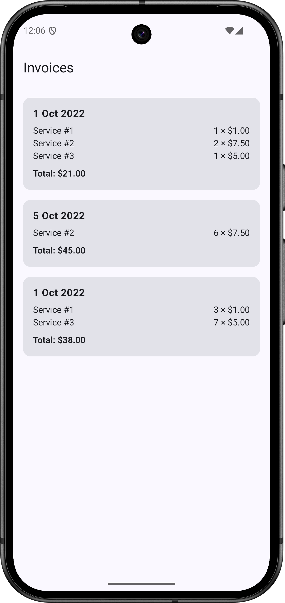

# Invoice App

## Architectural approach
- **MVVM architecture** with a clear separation of concerns
- **Data layer**: Retrofit + Kotlinx Serialization and a `InvoiceRepository` for fetching data
- **Domain layer**: Core models (`Invoice`, `InvoiceLineItem`) and `GetInvoicesUseCase` for business logic
- **Presentation layer**: `InvoiceListViewModel` with `StateFlow` for UI state, `Composable` functions for UI

## Technical notes
- **Dates**: Using `java.time` with core library desugaring for backward compatibility (pre-API 26)
- **Third-party libraries**:
  - Retrofit - networking client
  - Kotlinx Serialization - JSON parsing
  - Hilt - dependency injection
  - Jetpack Compose - UI framework
  - JUnit 4, kotlinx-coroutines-test, MockK, Turbine - testing
  - Timber - logging

## Running the project
1. Clone the repository
2. Open in Android Studio (latest stable)
3. Run on API 21+ emulator or device

## Trade-offs
- **UI**: One list screen only (no details screen, no sorting). I chose to display individual line items on the list screen for this task, but in a production app they would likely be better placed in a details screen.
- **Tests**:
  - Only unit tests (JUnit 4 for easier setup)
  - No UI/snapshot tests
  - Mock services used. In a production app I would also add `MockWebServer` integration tests with JSON responses.
- **Domain layer**: Added to demonstrate layer separation. In a production app, I would keep it if the business logic grows, or consider omitting it if it stays thin.
- **Code quality**: No linter or CI/CD
- **Error handling**: All errors treated the same for simplicity (empty, network, parsing)
- **Currency**: Assumed all values are AUD
- **Mapping**: Extension functions in the ViewModel/Repository to streamline the logic
- **Repository**: No interface in this project. In a production app, I would expose one for faking in tests (e.g. `InvoiceRepository`, `InvoiceRepositoryImpl`, `FakeInvoiceRepository`)
- **Pagination**: Not implemented. The endpoint is static and small, so I kept it as a single fetch for simplicity.

## Future improvements
- Add a details screen to display invoice line items more fully
- Add sorting and filtering of invoices
- Add UI and snapshot tests
- Add integration tests using `MockWebServer`
- Add CI/CD pipeline with linting and automated tests
- Improve error handling by distinguishing between empty, network and parsing errors for a better user experience
- Support multiple currencies
- Introduce repository interfaces for easier faking in tests
- Extract mapper classes from ViewModel/Repository for clearer separation and better testability
- Introduce pagination logic for large datasets